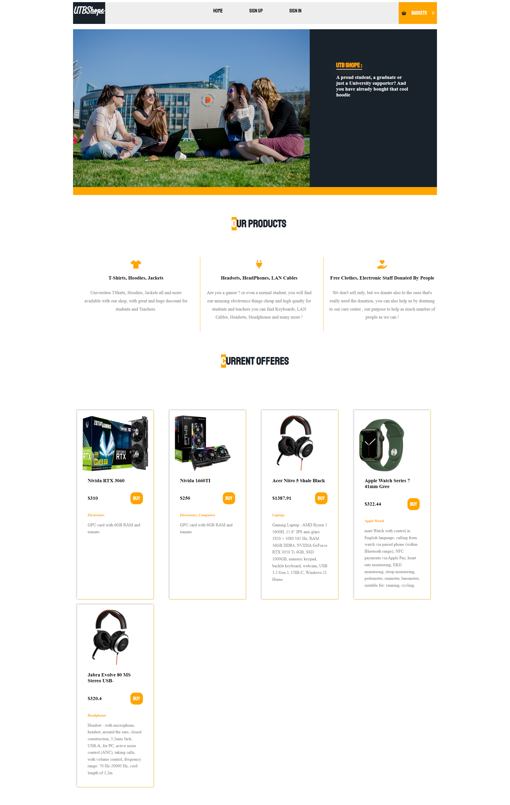
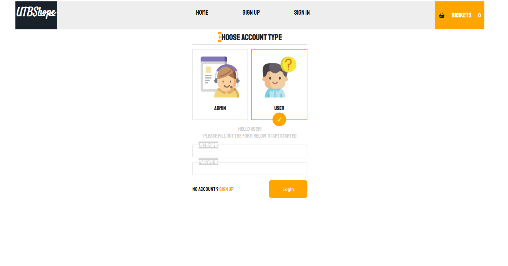
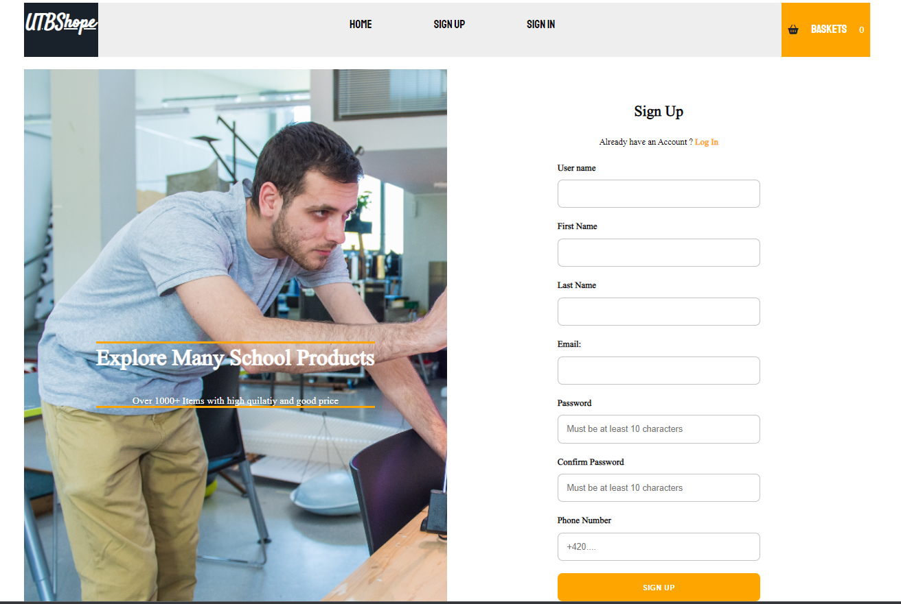
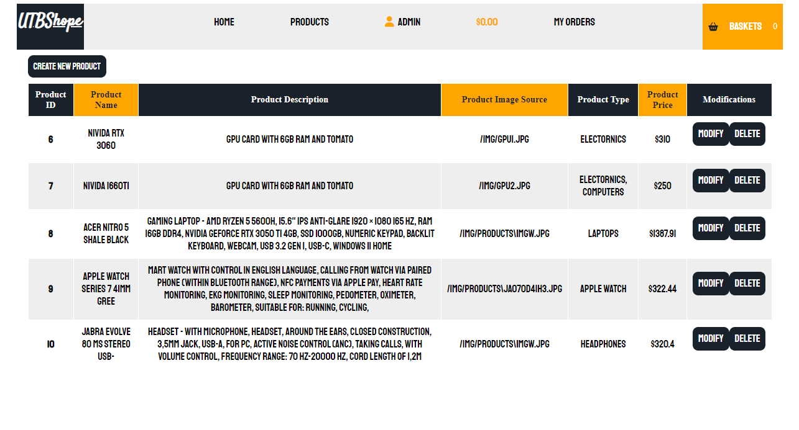
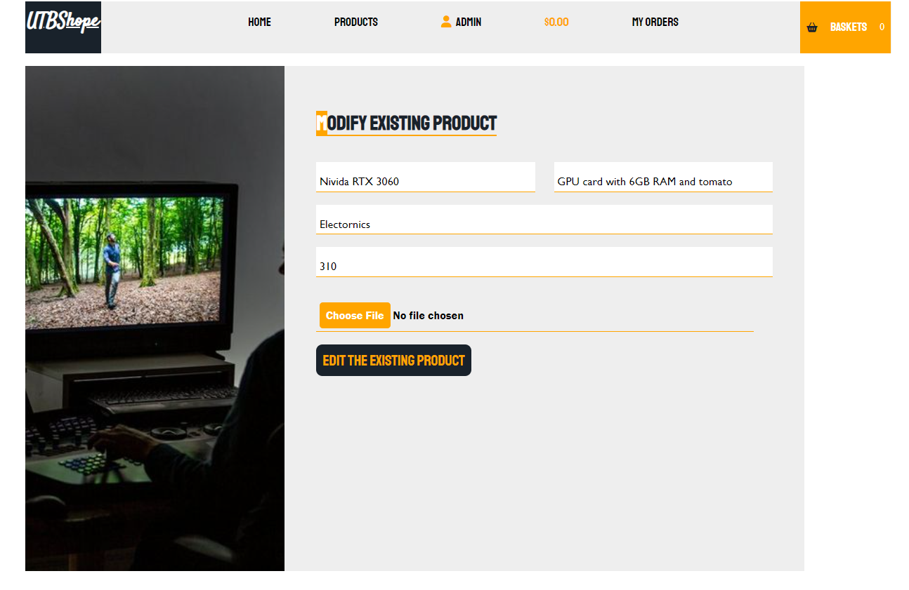
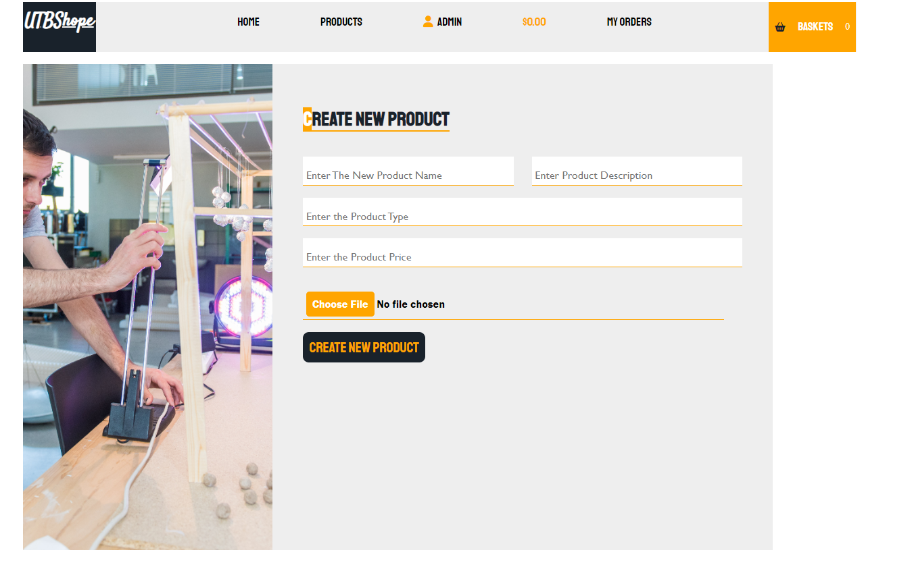
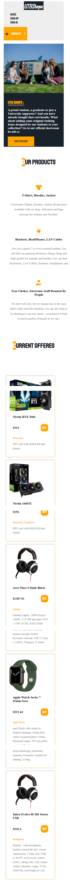

# **ECommerceFullStack**

### Description of the App:
Full Stack ASP.NET (.NET6) MVC Responsive E-shop website 
* **Technologies Used:**
  * HTML5
  * CSS3 [Responsive Design]
  * JavaScript
  * ASP.NET Core MVC (.NET6)
  * MS SQL Server OR [MySQL]
  * Bootstrap 
  * Some JQuery 
  * CSS3 and JavaScript Animations
  * Entity Core FraneWork as ORM
* **Features:**
  * Responsive Design Using Media Queries
  * Special Admin Routing
  * Special User Routing
  * Special Guest Routing
  * Sign up 
  * Sign in 
  * Cart [Basket] of Items 
  * Client Side Validation
  * Server Side Validation
  * Authorization and Authentication 
  * Cookies Managment
  * Managment of Products By Admin 
  * Managment of Users By Admin 
  * Orders Confirmation By Users 
  * Orders Managment By Admin 
  * Upload Product Images from PC to Server [App Dir]
  * Partial View, Components, Normal Views

 
 #### - Screenshots of the internal app after building:
 **- Home Page:**
</img>
 **- Login Page:**
</img>
 **- SignUp Page:**
</img>
 **- Cart Items:**
</img>
 **- Products Admin Managments:**
</img>
 **- Modifying Products Page:**
</img>
 **- Creating New Product Page:**
</img>
 **- Mobile View [Responsive Design]:**
</img>
* for the purpose of the Copyrights (credits) the following should be mentioned:
  * https://www.utb.cz/
